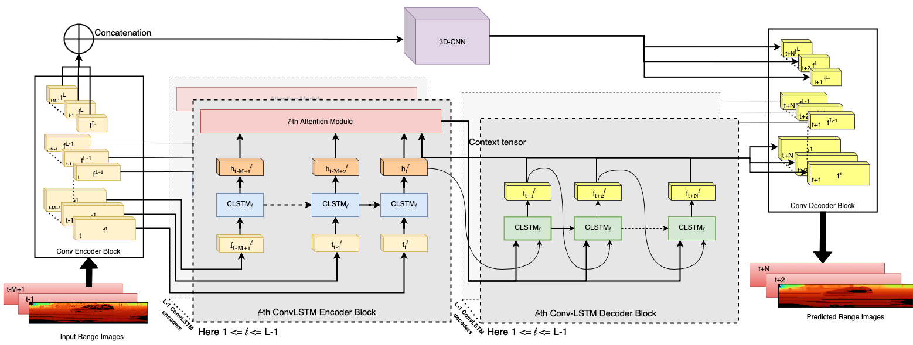

# ATPPNet: Attention based Temporal Point cloud Prediction Network
This is a Pytorch-Lightning implementation of the paper "*ATPPNet: Attention based Temporal Point cloud Prediction Network*" submitted to **ICRA 2024**.


**ATPPNet Architecture.** *ATPPNet leverages Conv-LSTM along with channel-wise and spatial attention dually complemented by a 3D-CNN branch for extracting an enhanced spatio-temporal context to recover high quality fidel predictions of future point clouds.*


## Table of Contents
1. [Installation](#Installation)
2. [Data](#Data)
3. [Training](#Training)
4. [Testing](#Testing)
5. [Download](#Dwnload)
6. [Acknowledgment](#Acknowledgment)


## Installation

Clone this repository and run 
```bash
cd atppnet
git submodule update --init
```
to install the Chamfer distance submodule. The Chamfer distance submodule is originally taken from [here](https://github.com/chrdiller/pyTorchChamferDistance) with some modifications to use it as a submodule. All parameters are stored in ```config/parameters.yaml```.

In our project, all our dependencies are managed by miniconda. 
Use the following command to create the conda environment:

```conda env create -f atppnet.yml```

Then activate the environment using the command ```conda activate atppnet```

## Data
### KITTI
Download the Kitti Odometry data from the official [website](http://www.cvlibs.net/datasets/kitti/eval_odometry.php).

We process the data in advance to speed up training. To prepare the dataset from the KITTI odometry dataset, set the value of ```GENERATE_FILES``` to true in ```config/parameters.yaml```. The environment variable ```PCF_DATA_RAW``` points to the directory containing the train/val/test sequences specified in the config file. It can be set with

```bash
export PCF_DATA_RAW=/path/to/kitti-odometry/dataset/sequences
```

and the destination of the processed files ```PCF_DATA_PROCESSED``` is set with

```bash
export PCF_DATA_PROCESSED=/desired/path/to/processed/data/
```
### nuScenes
Download the Lidar blobs for parts 1 and 2 and the metadata from the full dataset and map expansion pack(v1.0) from the official [website](https://www.nuscenes.org/nuscenes#download)

For preparing the nuScenes dataset, set up the folder structure in the following manner:
```
NuScenes
├── v1.0-test
│   ├── maps
│   ├── samples
│   │   └── LIDAR_TOP
│   ├── sweeps
│   │   └── LIDAR_TOP
│   └── v1.0-test
└── v1.0-trainval
    ├── maps
    ├── samples
    │   └── LIDAR_TOP
    ├── sweeps
    │   └── LIDAR_TOP
    └── v1.0-trainval
```
`v1.0-test/samples` and `v1.0-test/sweeps` contains the lidar scans from part 2 of the dataset, `v1.0-test/v1.0-test` contains the metadata files and `v1.0-test/maps` contains the data from map expansion pack.
Similarly, `v1.0-trainval/samples` and `v1.0-trainval/sweeps` contains the lidar scans from part 1 of the dataset, `v1.0-trainval/v1.0-trainval` contains the metadata files and `v1.0-trainval/maps` contains the data from map expansion pack.
In the parameters filr `config/nuscenes_parameters.yml`, change the value ```DATASET_PATH``` to the `NuScenes ` folder described above, and the the value of ```SAVE_PATH``` to the destination of processed images.

Then run:
```bash
python -m atppnet.utils.process_nuscenes
```

## Training
After following the [data preparation](#data-preparation) tutorial, the model can be trained in the following way:

### KITTI
The training script can be run by
```bash
python -m atppnet.train
```
using the parameters defined in ```config/parameters.yaml```. Pass the flag ```--help``` if you want to see more options like resuming from a checkpoint or initializing the weights from a pre-trained model. A directory will be created in ```pcf/runs``` which makes it easier to discriminate between different runs and to avoid overwriting existing logs. The script saves everything like the used config, logs and checkpoints into a path ```pcf/runs/COMMIT/EXPERIMENT_DATE_TIME``` consisting of the current git commit ID (this allows you to checkout at the last git commit used for training), the specified experiment ID (```pcf``` by default) and the date and time.

*Example:*
```pcf/runs/7f1f6d4/pcf_20211106_140014```

```7f1f6d4```: Git commit ID

```pcf_20211106_140014```: Experiment ID, date and time

### nuScenes
The training script on the nuScenes dataset can be run by
```bash
python -m atppnet.train_nuscenes
```

## Testing
### KITTI
Test your model by running
```bash
python -m atppnet.test -m COMMIT/EXPERIMENT_DATE_TIME
```
where ```COMMIT/EXPERIMENT_DATE_TIME``` is the relative path to your model in ```pcf/runs```. *Note*: Use the flag ```-s``` if you want to save the predicted point clouds for visualiztion and ```-l``` if you want to test the model on a smaller amount of data.

*Example*
```bash
python -m atppnet.test -m 7f1f6d4/pcf_20211106_140014
```
or 
```bash
python atppnet.test -m 7f1f6d4/pcf_20211106_140014 -l 5 -s
```
if you want to test the model on 5 batches and save the resulting point clouds.

### nuScenes
Test your model by running
```bash
python atppnet.test_nuscenes -m COMMIT/EXPERIMENT_DATE_TIME
```
where ```COMMIT/EXPERIMENT_DATE_TIME``` is the relative path to your model in ```pcf/runs```. *Note*: Use the flag ```-s``` if you want to save the predicted point clouds for visualiztion and ```-l``` if you want to test the model on a smaller amount of data.

*Example*
```bash
python -m atppnet.test_nuscenes -m 7f1f6d4/pcf_20211106_140014
```
or 
```bash
python -m atppnet.test_nuscenes -m 7f1f6d4/pcf_20211106_140014 -l 5 -s
```
if you want to test the model on 5 batches and save the resulting point clouds.

## Download
We will soon release the best performing model weights.

## Acknowledgment
The codebase in this repo has been built on top of the amazing code base of [TCNet](https://github.com/PRBonn/point-cloud-prediction) by Benedikt Mersch, Andres Milioto and Christian Diller et al.
